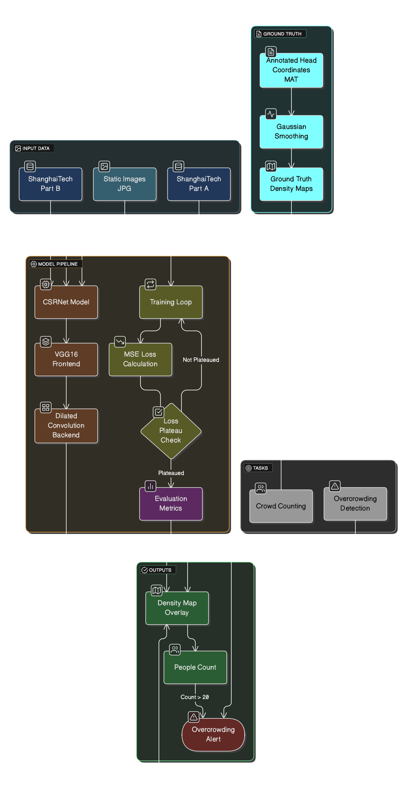
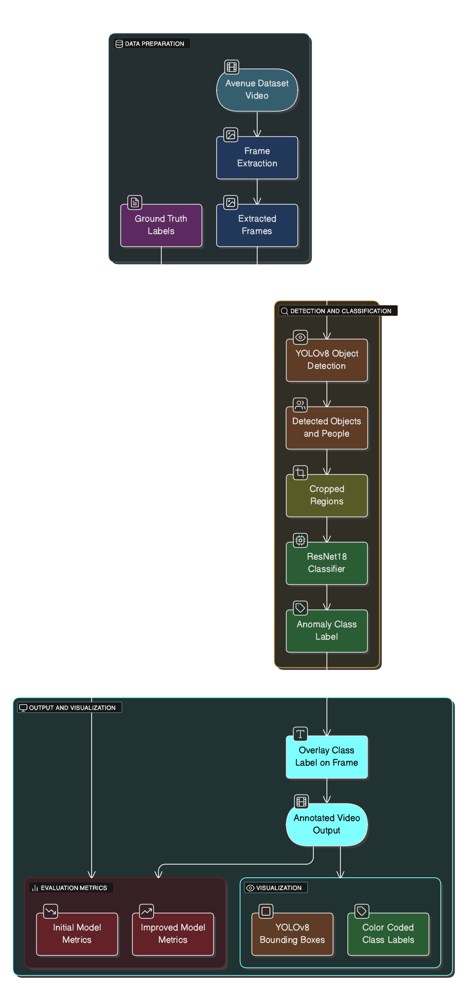

# Real-Time Anomaly Detection and Crowd Monitoring

This repository contains an interactive Streamlit app for:

1. **Avenue Dataset** – Person-centric anomaly classification using ResNet34 and YOLOv8.
2. **ShanghaiTech Dataset** – Crowd density estimation using CSRNet with YOLOv8 fallback logic for robust detection.

---

## Project Structure

```
root/
│
├── app.py
├── notebooks/
│   ├── Avenue_Anomaly_Detection.ipynb
│   ├── ShanghaiTech_Overcrowding.ipynb
│   └── Combined_Restructured.ipynb
├── assets/
│   ├── avenue_pipeline.png
│   └── csrnet_pipeline.png
├── README.md
├── requirements.txt
```

---

## How to Run

1. **Clone the repository**

```bash
git clone https://github.com/your-username/DATA606_Capstone_AnomalyDetection.git
cd DATA606_Capstone_AnomalyDetection
```

2. **(Optional) Create and activate a virtual environment**

```bash
python -m venv venv
source venv/bin/activate  # On Windows: venv\Scripts\activate
```

3. **Install all dependencies**

```bash
pip install -r requirements.txt
```

4. **Download required model files**

   * `yolov8m.pt` → from [Ultralytics](https://github.com/ultralytics/ultralytics#models)
   * `csrnet_shanghai.pt` → pretrained CSRNet model
   * `final_op_avenue_model.pt` → trained ResNet18 classifier for Avenue

> Place these files in the **root** directory of the project.

5. **Run the app**

```bash
streamlit run app.py
```

6. **View in browser**

Go to: `http://localhost:8501`

---

## Model Highlights

### ShanghaiTech (CSRNet-Based Crowd Counting)

* **Model Used:** CSRNet with VGG16 frontend and dilated convolutional backend
* **Purpose:** Predicts spatial density maps for crowd estimation from static surveillance images
* **Input:** Static images (`.jpg`) from **ShanghaiTech Part A & B**
* **Ground Truth:** Head annotations in `.mat` files converted to density maps using Gaussian smoothing
* **Output:** Predicted density map with total crowd count
* **Overcrowding Alert:** Triggered when count exceeds **20 people**
* **Evaluation Metrics:**

  * **Part A:** MAE: 207.91, RMSE: 317.36
  * **Part B:** MAE: 31.18, RMSE: 66.59

---

### Avenue Dataset (YOLOv8 + ResNet18-Based Anomaly Classification)

* **Models Used:**

  * **YOLOv8** for detecting people and objects in video frames
  * **ResNet18-based classifier** for anomaly type classification (fine-tuned on Avenue dataset)
* **Input:** Extracted video frames (`.avi → .jpg`)
* **Ground Truth:** Frame-level anomaly labels in `.mat` files
* **Output:** Frame-level class labels:

  * **Normal**
  * **Unusual Action**
  * **Abnormal Object**
* **Visualization:** Annotated videos with bounding boxes and color-coded labels
* **Evaluation Metrics:**
* Original Loss: **92.17**, Improved Loss: **68.76**

---

## Architecture Overview

### ShanghaiTech Crowd Monitoring (CSRNet)



### Avenue Anomaly Detection (YOLOv8 + ResNet18)



---

## Requirements

See `requirements.txt` for full list. Major libraries:

* torch
* torchvision
* streamlit
* opencv-python
* matplotlib
* ultralytics
* pillow
* numpy

---

## Developed By

- Stuti Upadhyay — UMBC | DATA 606 Capstone Project
- Lakshmi Tejaswini Chandra Pampana — UMBC | DATA 606 Capstone Project

---
