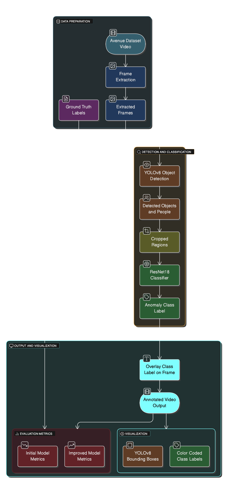
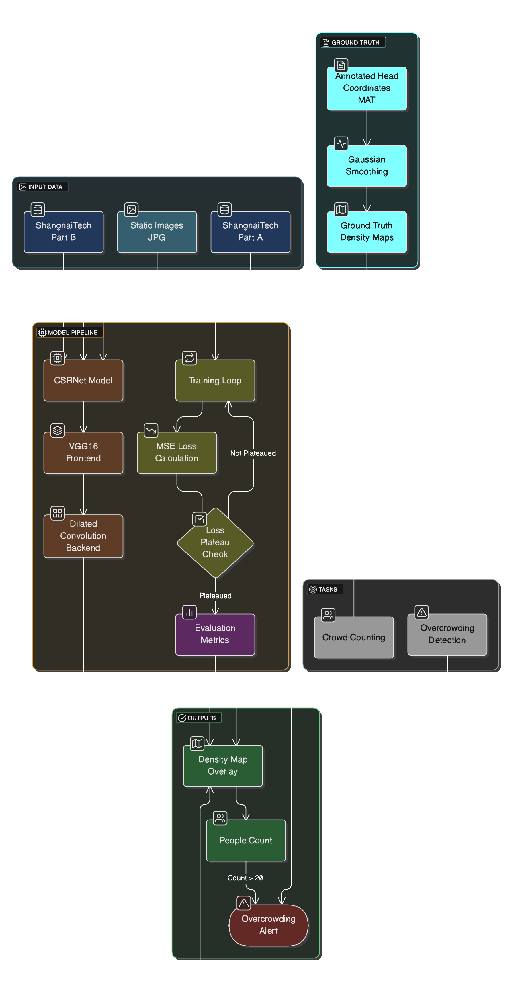

# Real-Time Anomaly Detection and Crowd Monitoring

An AI-powered surveillance system combining **YOLOv8**, **ResNet18**, and **CSRNet** to detect anomalous behavior and monitor crowd density in real time. Built as a UMBC DATA606 Capstone Project and deployed as an interactive Streamlit application.

🔗 **[Live Demo — Launch the App](https://anomalydetectioncapstone-aagua27sjxluyvjretnrul.streamlit.app)**

---

## Performance Highlights

| Dataset | Model | Metric | Score |
|---|---|---|---|
| ShanghaiTech Part A | CSRNet | MAE | 207.91 |
| ShanghaiTech Part A | CSRNet | RMSE | 317.36 |
| ShanghaiTech Part B | CSRNet | MAE | **31.18** |
| ShanghaiTech Part B | CSRNet | RMSE | 66.59 |
| Avenue Dataset | YOLOv8 + ResNet18 | Loss (original) | 92.17 |
| Avenue Dataset | YOLOv8 + ResNet18 | Loss (improved) | **68.76** |

---

## What It Does

The system addresses two core surveillance challenges:

1. **Anomaly Detection (Avenue Dataset)** — Classifies unusual behavior in pedestrian surveillance footage using YOLOv8 for object detection and a fine-tuned ResNet18 classifier. Detects running, throwing, abnormal objects (bikes, bags, carts), and unusual movement directions.

2. **Crowd Density Estimation (ShanghaiTech Dataset)** — Generates density maps and estimates head counts using CSRNet with a YOLOv8 fallback for robust detection. Triggers overcrowding alerts when count exceeds 20.

---

## Motivation

Traditional surveillance depends on human operators who are prone to fatigue, distraction, and delayed response. As environments grow more complex, automated AI-driven detection becomes essential for scalable, accurate, real-time monitoring. This project integrates deep learning models into a production-ready Streamlit interface designed for practical deployment.

---

## Project Structure

```
root/
├── app.py                               # Streamlit dashboard combining both modules
├── notebooks/
│   ├── Avenue_Anomaly_Detection.ipynb   # YOLOv8 + ResNet18 for anomaly detection
│   └── ShanghaiTech_Overcrowding.ipynb  # CSRNet-based crowd density estimation
├── assets/
│   ├── avenue_pipeline.png              # Anomaly detection architecture diagram
│   └── csrnet_pipeline.png              # Crowd monitoring architecture diagram
├── references/                          # Supporting research papers (PDF)
├── requirements.txt
└── README.md
```

---

## Architecture

### Avenue Dataset — Anomaly Detection (YOLOv8 + ResNet18)



- **Object Detection:** YOLOv8 detects people and objects per frame
- **Classification:** Fine-tuned ResNet18 classifies each frame as Normal / Unusual Action / Abnormal Object
- **Input:** Video frames extracted from `.avi` files
- **Output:** Annotated video with bounding boxes and class labels
- **Labels:** Normal, Unusual Action, Abnormal Object

### ShanghaiTech — Crowd Monitoring (CSRNet)



- **Model:** CSRNet with VGG16 frontend and dilated convolutional backend
- **Input:** `.jpg` images with annotated `.mat` ground truth (head coordinates)
- **Output:** Density map + total head count estimate
- **Alert:** Overcrowding triggered when count exceeds 20

---

## Datasets

### Avenue Dataset
- 16 training videos (normal behavior only), 21 test videos (with anomalies)
- ~15,328 test frames at 640x360 resolution, ~25 FPS
- Static camera on a single pedestrian avenue
- Anomalies: running, throwing objects, abnormal directions, bikes, bags, carts

### ShanghaiTech Dataset
- **Part A** (dense crowds): 300 train / 182 test annotated images
- **Part B** (sparse crowds): 400 train / 316 test annotated images
- Ground truth: `.mat` files with head coordinates converted to Gaussian density maps

---

## Setup

```bash
git clone https://github.com/stutiupadhyay03/AnomalyDetection_Capstone.git
cd AnomalyDetection_Capstone
```

```bash
# Optional: create a virtual environment
python -m venv venv
source venv/bin/activate  # Windows: venv\Scripts\activate
```

```bash
pip install -r requirements.txt
```

Download the required model files and place them in the root directory:
- `yolov8m.pt` — from [Ultralytics](https://github.com/ultralytics/ultralytics)
- `csrnet_shanghai.pt` — pretrained CSRNet model
- `final_op_avenue_model.pt` — fine-tuned ResNet18 classifier for Avenue

```bash
streamlit run app.py
# Open: http://localhost:8501
```

---

## Future Directions

- **Live stream integration** — CCTV/webcam feeds via OpenCV/RTSP
- **Temporal modeling** — LSTM/GRU/Transformer after ResNet for motion context across frames
- **Expanded anomaly classes** — fighting, climbing, tailgating, unauthorized gatherings
- **Alert system** — email/SMS/dashboard notifications via Twilio or SendGrid
- **Edge deployment** — Jetson devices for real-time inference; AWS/Azure/GCP for scalable cloud deployment

---

## Developed By

- **Stuti Upadhyay** — UMBC | DATA606 Capstone | [github.com/stutiupadhyay03](https://github.com/stutiupadhyay03)
- **Lakshmi Tejaswini Chandra Pampana** — UMBC | DATA606 Capstone

---

## Stack

`PyTorch` · `YOLOv8 (Ultralytics)` · `ResNet18` · `CSRNet` · `OpenCV` · `Streamlit` · `Python`

---

## References

1. Choudhry et al. — *A Comprehensive Survey of Machine Learning Methods for Surveillance Videos Anomaly Detection*, Deakin University
2. Abbas & Al-Ani — *Anomaly Detection in Surveillance Videos Based on H265 and Deep Learning*, International Journal of Advanced Technology and Engineering Exploration, 2022
3. Nawaratne et al. — *Spatiotemporal Anomaly Detection Using Deep Learning for Real-Time Video Surveillance*, IEEE
4. Wenkel et al. — *Confidence Score: The Forgotten Dimension of Object Detection Performance Evaluation*
5. Vasudevan et al. — *Towards Better Confidence Estimation for Neural Models*, UC San Diego / Amazon Alexa AI
6. Lu et al. — *Abnormal Event Detection at 150 FPS in MATLAB*, The Chinese University of Hong Kong
7. Liu et al. — *Future Frame Prediction for Anomaly Detection — A New Baseline*
